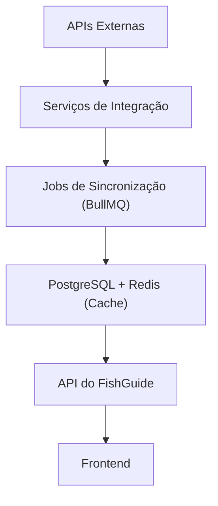

# Integrações Externas e Arquitetura das APIs

- **Projeto:** FishGuide
- **Versão:** 1.0

## 1. Objetivo

Definir todas as integrações do FishGuide com serviços externos, estabelecendo estratégias de sincronização, armazenamento, cache e tolerância a falhas.

O princípio adotado será:

- **Nenhuma API externa será consultada diretamente pelo Frontend.**

Toda comunicação ocorrerá através do Backend do FishGuide.

## 2. Arquitetura das Integrações

## 3. Princípios

**PI-001**

O Frontend nunca acessará APIs de terceiros.

**PI-002**

Todas as integrações serão centralizadas no Backend.

**PI-003**

Os dados serão armazenados localmente sempre que possível.

**PI-004**

Caso uma API fique indisponível, o sistema utilizará os últimos dados sincronizados.

**PI-005**

Toda sincronização será registrada para auditoria.

## 4. Categorias de Integração

O FishGuide trabalhará inicialmente com os seguintes grupos de informações:

- Meteorologia 

Marés 

Astronomia 

Mapas 

Geocodificação 

Qualidade da água (quando disponível) 

Alertas marítimos 

Notificações 

## 5. Serviço de Meteorologia

Informações necessárias:

- Temperatura 

Sensação térmica 

Pressão atmosférica 

Umidade 

Velocidade do vento 

Direção do vento 

Rajadas 

Índice UV 

Chuva 

Nebulosidade 

Visibilidade 

**Estratégia**

Atualização periódica. 

Cache em Redis. 

Histórico armazenado no PostgreSQL. 

## 6. Serviço de Marés

Informações:

- Alta-mar 

Baixa-mar 

Altura 

Horário 

Tendência (enchente, vazante, estofa) 

Coeficiente (quando disponível) 

**Estratégia**

Sincronização antecipada. 

Armazenamento de previsões para vários dias. 

Atualização automática conforme novas previsões forem disponibilizadas. 

## 7. Serviço de Astronomia

Informações:

- Nascer do Sol 

Pôr do Sol 

Nascer da Lua 

Pôr da Lua 

Fase da Lua 

Iluminação 

Esses dados poderão ser armazenados por longos períodos, pois são previsíveis.

## 8. Serviço de Mapas

Responsabilidades:

- Exibir mapas. 

Localizar o usuário. 

Calcular rotas. 

Pesquisar endereços. 

Buscar locais de pesca próximos. 

## 9. Geocodificação

Converter:

- endereço → coordenadas; 
- coordenadas → endereço. 

Será utilizada para cadastro de pesqueiros e exibição de localidades.

## 10. Qualidade da Água (Futuro)

Quando houver fonte de dados disponível, poderão ser integrados:

- Temperatura da água. 

Salinidade. 

Turbidez. 

Oxigênio dissolvido. 

Vazão. 

Nível do rio. 

Esses fatores poderão influenciar o Índice Inteligente de Pesca.

## 11. Alertas Marítimos

O sistema poderá exibir avisos como:

- Ressaca. 

Mar agitado. 

Ventos fortes. 

Tempestades. 

Interdições. 

## 12. Armazenamento Local

Nem todos os dados precisam ser mantidos pelo mesmo período.

## 13. Cache

Redis será utilizado para:

- Dados do dia. 

Tela **Hoje**. 

Locais populares. 

Ranking. 

Espécies mais consultadas. 

Dados do mapa. 

## 14. Estratégia de Atualização

Os dados serão atualizados conforme sua natureza.

Exemplos:

- Clima: várias vezes ao dia. 

Marés: sincronização antecipada de vários dias. 

Astronomia: atualização esporádica. 

Locais e espécies: sob demanda ou quando houver alterações. 

Os intervalos exatos ficarão configuráveis no sistema.

## 15. Tratamento de Falhas

Caso uma integração falhe:

- Registrar erro. 

Manter dados em cache. 

Agendar nova tentativa. 

Informar ao usuário a data da última atualização. 

## 16. Monitoramento

Cada integração registrará:

- **Data:** da sincronização.

- Tempo de resposta. 

Quantidade de dados processados. 

Erros. 

Última execução bem-sucedida. 

## 17. Segurança

As credenciais das APIs serão armazenadas em variáveis de ambiente.

Nunca serão expostas ao Frontend.

## 18. Evolução

Novas integrações poderão ser adicionadas sem modificar os módulos existentes, seguindo o padrão definido neste documento.

## 19. Um módulo que eu acrescentaria

Acredito que o FishGuide pode ter um módulo chamado **Motor de Dados**.

Ele ficará entre as APIs e o restante do sistema.

API Externa

↓

Motor de Dados

↓

Validação

↓

Padronização

↓

Enriquecimento

↓

Banco

↓

Frontend

Esse módulo resolverá problemas como:

- diferentes formatos de data; 
- unidades de medida distintas; 
- nomenclatura inconsistente; 
- valores ausentes; 
- duplicidade de informações. 

Assim, todo o restante do sistema trabalhará sempre com um formato único de dados.

## 20. Conceito de "Snapshot da Pescaria"

Esta é uma funcionalidade que considero um grande diferencial.

No momento em que o usuário inicia uma pescaria, o FishGuide cria um **Snapshot** contendo todas as condições daquele instante:

- clima; 
- pressão; 
- vento; 
- maré; 
- fase da lua; 
- nascer/pôr do sol; 
- localização; 
- horário. 

Esse snapshot será associado à pescaria e permanecerá imutável, mesmo que os dados externos mudem depois.

Graças a isso, anos depois o usuário poderá consultar exatamente quais eram as condições quando realizou aquela pescaria.

|     Tipo de dado    |         Estratégia        |
|---------------------|---------------------------|
| Clima               | Histórico para análises   |
| Marés               | Histórico e previsão      |
| Astronomia          | Histórico e previsão      |
| Mapas               | Apenas referências        |
| Alertas             | Temporário                |
| Qualidade da água   | Histórico                 |