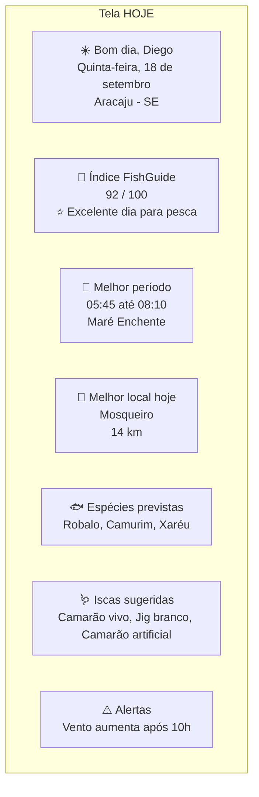
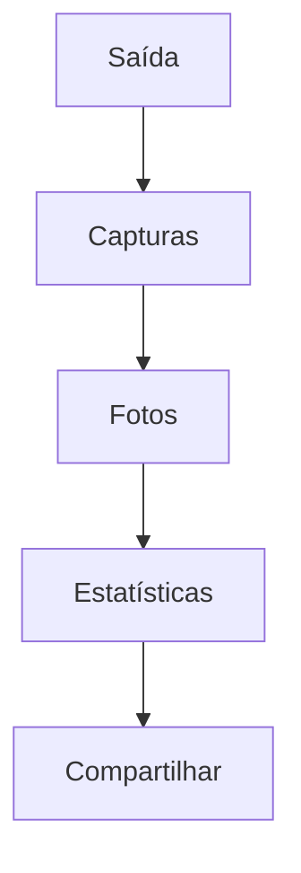
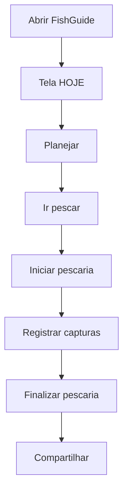
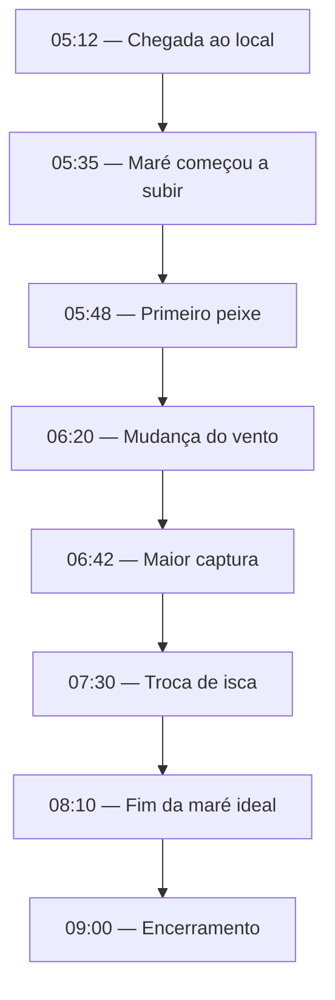

# Arquitetura da Experiência do Usuário (UX) e Fluxos de Navegação

- **Projeto:** FishGuide
- **Versão:** 1.0

## 1. Filosofia do FishGuide

O FishGuide não deve funcionar como um aplicativo onde o usuário precisa procurar informações.

Ele deve responder perguntas.

Ao abrir o aplicativo, o pescador quer saber:

- "Vale a pena pescar hoje?"

E não:

- "Qual é a pressão atmosférica?"

Por isso, toda informação técnica deve existir, mas como apoio à tomada de decisão.

## 2. O conceito da Tela "HOJE"

A tela **HOJE** será o centro do sistema.

Todo o restante será acessado a partir dela.

Ela deve responder imediatamente:

- ✔ Vale a pena pescar?

✔ Onde?

✔ Que horas?

✔ Qual peixe?

✔ Qual isca?

✔ Qual equipamento?

✔ Quanto tempo devo ficar?

## 3. Estrutura da Tela HOJE



Observe que o usuário ainda **não precisou abrir nenhuma outra tela**.

## 4. Filosofia das Informações

As informações terão três níveis.

**Nível 1**

Resposta rápida.

Exemplo:

- Excelente dia para pesca.

**Nível 2**

Resumo.

Exemplo:

- Maré enchente + Lua crescente.

**Nível 3**

Detalhes técnicos.

Ao clicar:

- pressão 
- vento 
- gráficos 
- marés 
- clima 
- lua 

## 5. Menu Principal

Eu reduziria bastante o menu.

HOJE

MAPA

DIÁRIO

COMUNIDADE

PERFIL

Somente.

Todo o restante ficará dentro dessas áreas.

## 6. Mapa

O mapa será praticamente outro sistema.

Ele permitirá:

- Pesqueiros.

Eventos.

Amigos.

Marinas.

Rampas.

Lojas.

Rotas.

Clima.

Marés.

Tudo em tempo real.

## 7. Diário

O Diário será o segundo recurso mais utilizado.

Cada saída de pesca será um registro.



## 8. Comunidade

A comunidade será organizada por assuntos.

Não apenas por ordem cronológica.

Exemplo:

- ```mermaid
graph TD
    Espécies --> Robalo
    Robalo --> Capturas["Últimas Capturas"]
    Capturas --> Dicas
    Dicas --> Vídeos
    Vídeos --> Equipamentos
```

## 9. Perfil

O perfil mostrará:

- Estatísticas.

Conquistas.

Equipamentos.

Histórico.

Espécies.

Locais favoritos.

## 10. Busca Inteligente

Uma única busca.

Exemplo.

Usuário digita:

- Robalo

Resultado.

Espécie.

Locais.

Capturas.

Eventos.

Artigos.

Vídeos.

Usuários especialistas.

## 11. Ação Principal

O botão mais importante do sistema será:

- + Nova Pescaria

Esse botão deve estar sempre acessível.

## 12. Fluxo Principal



## 13. Fluxo "Estou Pescando"

Este será um modo especial.

Quando ativado:

- ```mermaid
graph TD
    Pesca["Estou pescando"] --> GPS
    GPS --> Cronômetro
    Cronômetro --> Clima["Atualização do clima"]
    Clima --> Maré["Atualização da maré"]
    Maré --> Captura["Registrar captura"]
    Captura --> Foto["Adicionar foto"]
    Foto --> Finalizar
```

## 14. Modo Offline

Mesmo sem internet.

O usuário poderá:

- Registrar capturas.

Salvar fotos.

Consultar diário.

Consultar favoritos.

Quando voltar a internet.

Sincronização automática.

## 15. Uma ideia que acho que será o maior diferencial

Até agora pensamos em um sistema.

Mas acredito que podemos criar um verdadeiro **companheiro de pesca**.

**Antes da pescaria**

O FishGuide ajuda a decidir:

- se vale a pena sair; 
- para onde ir; 
- quando sair de casa; 
- o que levar. 

**Durante a pescaria**

O FishGuide acompanha:

- tempo; 
- maré; 
- capturas; 
- localização; 
- cronômetro; 
- fotos. 

**Depois da pescaria**

Ele gera automaticamente:

- relatório; 
- estatísticas; 
- resumo; 
- publicação para a comunidade. 

Assim, o aplicativo acompanha toda a jornada do pescador, não apenas o planejamento.

## 16. Um recurso que considero revolucionário

Gostaria de propor um conceito chamado **Linha do Tempo da Pescaria**.

Imagine que, durante a pescaria, o sistema registre automaticamente:



Depois, o usuário poderá visualizar essa linha do tempo junto com gráficos de maré, clima e capturas. Com o tempo, isso criará um histórico extremamente rico para análises pessoais e futuras recomendações.