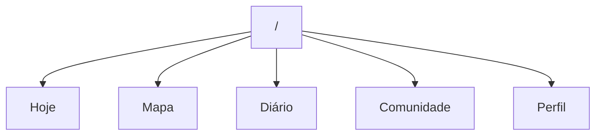
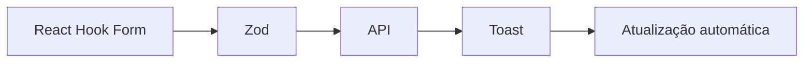
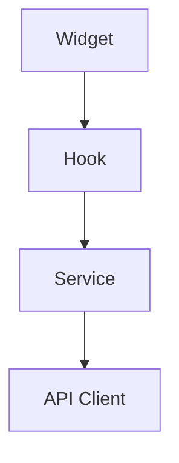
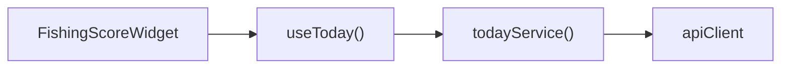

# Arquitetura do Frontend

- **Projeto:** FishGuide
- **Versão:** 1.0

## 1. Objetivo

Definir a arquitetura do frontend do FishGuide, garantindo escalabilidade, reutilização de componentes, desempenho e facilidade de manutenção.

## 2. Tecnologias

**Framework**

Next.js (App Router) 

**Linguagem**

TypeScript 

**Estilização**

Tailwind CSS 

- shadcn/ui 

**Gerenciamento de Estado**

Zustand 

**Cache e Requisições**

TanStack Query 

**Formulários**

React Hook Form 

Zod 

**Mapas**

Leaflet 

**Ícones**

Lucide React 

**Gráficos**

Recharts 

## 3. Organização das Pastas

- src/

- app/

- features/

- components/

- hooks/

- services/

- stores/

- types/

- lib/

- utils/

- styles/

- assets/

- config/

## 4. Filosofia

O frontend será organizado por **feature** (funcionalidade), e não apenas por tipo de arquivo.

Exemplo:

- features/

- today/

- community/

- spots/

- species/

- weather/

- tides/

- astronomy/

- trips/

- equipment/

- profile/

- auth/

- admin/

Cada feature conterá seus próprios componentes, hooks e lógica.

## 5. Estrutura de uma Feature

Exemplo:

- features/

- today/

- components/

- hooks/

- services/

- types/

- schemas/

- utils/

- index.ts

Assim, tudo relacionado à tela **HOJE** ficará agrupado.

## 6. Componentes Compartilhados

A pasta components/ conterá apenas elementos reutilizáveis.

Exemplos:

- Button

Card

Avatar

Badge

Dialog

Modal

Tooltip

Tabs

Table

Input

Select

Loading

EmptyState

ConfirmDialog

Map

Chart

## 7. Layouts

Teremos layouts independentes.

(auth)

(app)

(admin)

**Layout Auth**

Login 

Cadastro 

Recuperação de senha 

**Layout App**

Aplicação principal.

**Layout Admin**

Painel administrativo.

## 8. Organização das Rotas

Rotas:

- /

- today

- map

- trips

- community

- profile

- settings

- admin

## 9. Tela Principal

A primeira tela será sempre:

- HOJE

Nunca um dashboard genérico.

Essa tela será construída por widgets independentes.

## 10. Widgets

Cada informação será um widget.

Exemplo:

- FishingScoreWidget

WeatherWidget

MoonWidget

TideWidget

SpeciesWidget

BestSpotWidget

AlertWidget

MissionWidget

RecommendationWidget

Esses widgets poderão ser reorganizados conforme a preferência do usuário.

## 11. Sistema de Cards

Todos os widgets utilizarão um componente base.

<BaseCard>

Título

Conteúdo

Ações

Footer

</BaseCard>

Isso garante consistência visual e facilita futuras alterações.

## 12. Tema

O sistema suportará:

- Claro 

Escuro 

Automático (segue o sistema operacional) 

## 13. Responsividade

O projeto será **mobile-first**.

Breakpoints sugeridos:

- Mobile 

Tablet 

Notebook 

Desktop 

UltraWide 

Todos os componentes deverão funcionar em qualquer resolução.

## 14. Estados das Telas

Cada página deve prever:

- Loading 

Empty 

Error 

Offline 

Success 

Nenhuma tela exibirá uma área em branco enquanto aguarda dados.

## 15. Cache

Toda consulta será feita utilizando TanStack Query.

Estratégia:

- Cache local. 

Revalidação automática. 

Atualização em segundo plano. 

Sincronização após mutações. 

## 16. Gerenciamento de Estado

Usaremos Zustand apenas para estado global.

Exemplos:

- Auth

Theme

Notifications

Location

Filters

Sidebar

Today

Dados vindos da API permanecerão no TanStack Query.

## 17. Formulários

Todos os formulários seguirão o mesmo padrão.

Fluxo:

## 18. Consumo da API

Nenhum componente chamará a API diretamente.

Fluxo:

Exemplo:

Isso facilita testes e substituições futuras.

## 19. Sistema de Permissões

Os componentes poderão ser ocultados conforme o perfil do usuário.

Exemplo:

- Administrador 

Moderador 

Usuário 

## 20. Internacionalização

Mesmo iniciando em português, a arquitetura já suportará:

- Português (Brasil) 

Inglês 

Espanhol 

## 21. Upload de Imagens

Fluxo:

- Selecionar foto

↓

Compressão

↓

Preview

↓

Upload

↓

Salvar URL

Isso melhora a experiência em conexões móveis.

## 22. Notificações

Tipos:

- Toast 

Banner 

Push 

Modal 

Badge 

Cada uma usada conforme o contexto.

## 23. Offline

O frontend armazenará:

- Diário 

Favoritos 

Última tela HOJE 

Dados sincronizados recentemente 

Quando a conexão retornar:

- sincronização automática; 
- resolução de conflitos quando necessário. 

## 24. Monitoramento

Integração com:

- Sentry 

Analytics (respeitando a privacidade) 

Logs de erros do frontend 

## 25. Testes

Estratégia sugerida:

- Testes unitários para componentes. 

Testes de integração para features. 

Testes end-to-end para fluxos principais (login, planejamento, registro de pescaria). 

## 26. A ideia que considero um diferencial

Gostaria que a tela **HOJE** fosse completamente modular.

Imagine que o usuário possa montar sua própria experiência.

Exemplo:

- ★★★★★ Meu FishGuide

1. Índice de Pesca

2. Missão de Hoje

3. Maré

4. Clima

5. Mapa

6. Lua

7. Espécies

8. Alertas

Outro pescador pode preferir:

- ★★★★★ Meu FishGuide

1. Mapa

2. Maré

3. Vento

4. Pressão

5. Equipamentos

6. Diário

Isso significa que o FishGuide se adapta ao pescador, e não o contrário.

## 27. Uma funcionalidade que eu adicionaria

**🎣 Modo "Saindo para Pescar"**

Quando o usuário tocar no botão **"Iniciar Missão"**, o frontend muda automaticamente para um modo focado na pescaria.

A interface simplifica e destaca apenas o essencial:

- cronômetro da pescaria; 
- mapa com a posição atual; 
- maré em tempo real; 
- clima e vento; 
- botão **Registrar Captura**; 
- botão **Adicionar Foto**; 
- alertas importantes. 

Ao finalizar a pescaria, a interface volta ao modo normal e gera automaticamente o resumo da saída.

Na minha visão, isso reduz distrações e transforma o FishGuide em uma ferramenta prática durante a pescaria.