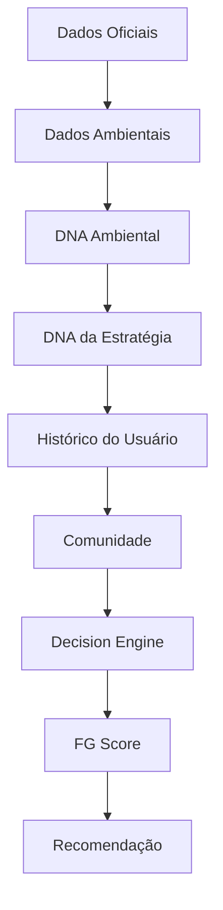

# FG Score Engine – Algoritmo Inteligente de Recomendação

- **Projeto:** FishGuide
- **Versão:** 1.0

## 1. Objetivo

O FG Score Engine é o motor responsável por transformar centenas de variáveis ambientais, históricas e comportamentais em uma recomendação simples, clara e confiável para o pescador.

Seu objetivo não é prever capturas com certeza, mas **estimar a probabilidade de sucesso** e explicar os motivos dessa estimativa.

## 2. Filosofia

O FishGuide nunca afirmará:

- "Você vai pegar peixe."

Ele dirá algo como:

- "Com base nas condições atuais e em pescarias semelhantes, a probabilidade de sucesso é alta."

Essa distinção é importante para manter transparência e credibilidade.

## 3. Arquitetura do Motor

## 4. Componentes do FG Score

O score será composto por vários módulos independentes.

**Importante:** esses pesos serão configuráveis por espécie e por ambiente de pesca.

## 5. Normalização

Cada variável será convertida para uma escala comum de 0 a 100.

Exemplo:

- Maré Enchente → 100

Maré Vazante → 45

Pressão Ideal → 95

Pressão Muito Baixa → 30

Assim, diferentes tipos de dados poderão ser combinados de forma consistente.

## 6. Cálculo por Espécie

O motor calculará um score individual para cada espécie cadastrada.

Exemplo:

- Robalo      → 94

Camurim     → 88

Pescada     → 79

Xaréu       → 61

O índice geral do dia será derivado desses resultados.

## 7. Cálculo por Local

Cada pesqueiro receberá um score próprio.

Exemplo:

- Mosqueiro      → 96

Caueira        → 82

Croa do Goré   → 77

Atalaia        → 65

Assim, dois locais próximos podem ter recomendações completamente diferentes.

## 8. Cálculo por Horário

O sistema calculará uma curva de oportunidade.

04:00 → 42

05:00 → 71

06:00 → 95

07:00 → 98

08:00 → 91

09:00 → 73

Essa curva alimentará o gráfico da Tela **HOJE**.

## 9. DNA Ambiental

Cada pescaria gera um conjunto de características ambientais.

Exemplo:

- Maré: Enchente

Lua: Crescente

Pressão: 1018 hPa

Vento: Leste

Velocidade: 8 km/h

Temperatura: 27°C

Horário: 06:10

Tipo de Água: Salobra

Esse conjunto será utilizado para localizar pescarias semelhantes.

## 10. DNA da Estratégia

Além do ambiente, o FishGuide registrará **como o pescador pescou**.

Exemplo:

- Espécie-alvo

Robalo

Isca

Camarão Vivo

Equipamento

Molinete 2500

Linha

0,28 mm

Técnica

Arremesso

Profundidade

1,5 m

Esse DNA ajudará o sistema a responder perguntas como:

- "Qual estratégia teve maior sucesso em condições parecidas?"

## 11. Similaridade

O algoritmo buscará pescarias semelhantes.

Exemplo:

- DNA Atual

↓

Pesquisar banco

↓

Encontradas

143 pescarias semelhantes

↓

Taxa de sucesso

81%

Esse resultado influenciará diretamente o FG Score.

## 12. Nível de Confiança

O score sempre será acompanhado de um indicador de confiança.

Fatores considerados:

- qualidade dos dados meteorológicos; 
- atualização das informações; 
- histórico do usuário; 
- volume de registros semelhantes; 
- confiabilidade das contribuições da comunidade. 

Exemplo:

- FG Score

92

Confiança

96%

## 13. Explicabilidade

Toda recomendação deverá responder:

- **Por que o sistema chegou a essa conclusão?**

Exemplo:

- Maré enchente. 

Lua crescente. 

Pressão estável. 

143 pescarias semelhantes. 

Seu histórico pessoal indica bom desempenho nessas condições. 

## 14. Aprendizado

O algoritmo evoluirá em três fases.

**Fase 1**

Regras fixas.

**Fase 2**

Regras + histórico.

**Fase 3**

Machine Learning.

Cada fase aproveitará os dados gerados pela anterior.

## 15. Personalização

O FishGuide criará um perfil de pesca para cada usuário.

Com o tempo, o sistema aprenderá preferências como:

- horários mais produtivos; 
- espécies mais capturadas; 
- técnicas mais eficientes; 
- locais favoritos; 
- iscas com maior taxa de sucesso. 

Essas informações terão impacto gradual no score.

## 16. Transparência

O usuário nunca verá apenas um número.

Sempre receberá um resumo interpretável.

Exemplo:

- Hoje é um excelente dia para robalo. A combinação entre maré enchente, pressão estável e seu histórico em condições semelhantes aumenta significativamente a chance de sucesso.

## 17. Versionamento do Algoritmo

Cada cálculo armazenará a versão do motor.

Exemplo:

- FG Score Engine

- v1.0

Se a fórmula evoluir no futuro, será possível comparar resultados históricos sem perder rastreabilidade.

## 18. Simulações

O usuário poderá fazer simulações.

Exemplo:

- "E se eu sair às 07:30 em vez de 05:30?"

O sistema recalcula o score considerando o novo horário.

Também poderá responder perguntas como:

- "E se eu pescar em outro local?" 

"E se eu trocar a espécie-alvo?" 

"E se o vento aumentar?" 

## 19. Comparação de Cenários

Uma funcionalidade avançada permitirá comparar dois ou mais planos de pescaria.

Exemplo:

- Isso ajuda o usuário a decidir entre diferentes opções.

## 20. A ideia que considero o maior diferencial do FishGuide

**🎯 Simulador de Missão**

Imagine que o usuário diga:

- "Quero pescar robalo no sábado pela manhã."

O FishGuide poderá montar automaticamente diferentes estratégias.

**Plano A**

Saída: 04:40 

Local: Mosqueiro 

Isca: Camarão vivo 

Score: 94 

**Plano B**

Saída: 05:20 

Local: Caueira 

Isca: Camarão artificial 

Score: 89 

**Plano C**

Saída: 06:00 

Local: Croa do Goré 

Isca: Jig branco 

Score: 84 

O usuário não apenas recebe uma recomendação, mas pode comparar estratégias completas antes de sair de casa.

|         Módulo         |  Peso Inicial  |
|------------------------|----------------|
| Maré                   | 25%            |
| Pressão Atmosférica    | 15%            |
| Lua                    | 12%            |
| Horário                | 12%            |
| Clima                  | 8%             |
| Vento                  | 8%             |
| Temperatura            | 5%             |
| Histórico do Usuário   | 7%             |
| Comunidade             | 5%             |
| DNA Similar            | 3%             |

|         Cenário         |  FG Score  |  Confiança  |
|-------------------------|------------|-------------|
| Mosqueiro às 05:30      | 94         | 97%         |
| Caueira às 06:00        | 82         | 91%         |
| Croa do Goré às 07:00   | 76         | 88%         |