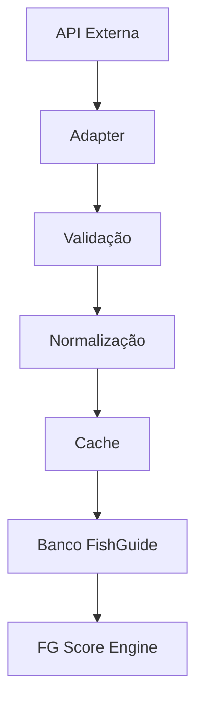
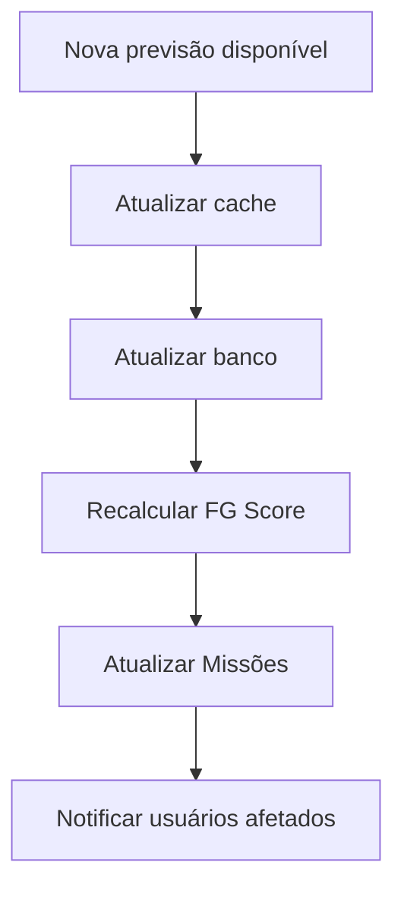

# Arquitetura de Integrações e Fontes de Dados

- **Projeto:** FishGuide
- **Versão:** 1.0

## 1. Objetivo

Definir como o FishGuide obterá, validará, armazenará e distribuirá dados externos, garantindo:

- alta disponibilidade; 
- confiabilidade; 
- independência de fornecedores; 
- escalabilidade; 
- baixo custo operacional. 

## 2. Filosofia

As APIs externas são **fontes de informação**, não parte da lógica do sistema.

Todo dado recebido deverá passar por um fluxo interno antes de ser utilizado.

## 3. Categorias de Dados

O FishGuide trabalhará com sete grandes grupos de dados.

**Dados Meteorológicos**

- temperatura; 
- chuva; 
- vento; 
- umidade; 
- pressão; 
- nebulosidade; 
- sensação térmica. 

**Dados Oceânicos**

- marés; 
- altura da maré; 
- horário das marés; 
- corrente; 
- temperatura da água (quando disponível). 

**Dados Astronômicos**

- nascer do sol; 
- pôr do sol; 
- nascer da lua; 
- pôr da lua; 
- fase da lua; 
- iluminação lunar. 

**Dados Geográficos**

- mapas; 
- geocodificação; 
- coordenadas; 
- distâncias; 
- rotas. 

**Dados Ambientais**

- unidades de conservação; 
- áreas protegidas; 
- alertas ambientais; 
- períodos de defeso. 

**Dados da Comunidade**

- capturas; 
- avaliações; 
- comentários; 
- fotos; 
- revisões. 

**Dados Históricos**

Produzidos pelo próprio FishGuide:

- DNAs das Pescarias; 
- FG Scores; 
- Missões; 
- Memória Coletiva da Pesca; 
- estatísticas. 

## 4. Camada de Adapters

Nenhuma API será consumida diretamente.

Cada integração terá um Adapter.

WeatherAdapter

TideAdapter

AstronomyAdapter

MapsAdapter

GeocodingAdapter

Se um provedor for substituído, apenas o Adapter será alterado.

## 5. Múltiplos Provedores

Cada tipo de dado poderá ter mais de um fornecedor.

Exemplo:

- Previsão do Tempo

↓

Fornecedor A

↓

Fornecedor B

↓

Fornecedor C

O sistema poderá:

- escolher automaticamente; 
- utilizar fallback; 
- comparar respostas; 
- monitorar qualidade. 

## 6. Normalização

Cada provedor utiliza formatos diferentes.

O FishGuide converterá tudo para um modelo interno único.

Exemplo:

- Fornecedor A

WindSpeed

↓

Fornecedor B

Wind Velocity

↓

FishGuide

- windSpeed

Assim, o restante do sistema nunca dependerá do formato externo.

## 7. Cache Inteligente

Nem todos os dados precisam ser buscados constantemente.

Estratégia inicial:

- Esses intervalos poderão ser ajustados.

## 8. Armazenamento

Todo dado externo será persistido.

Isso permite:

- histórico; 
- auditoria; 
- funcionamento offline; 
- redução de chamadas às APIs. 

## 9. Monitoramento

Cada integração registrará:

- tempo de resposta; 
- disponibilidade; 
- quantidade de chamadas; 
- taxa de erro; 
- custo (quando aplicável). 

## 10. Qualidade dos Dados

Nem sempre diferentes provedores concordam.

O FishGuide calculará um índice de qualidade.

Exemplo:

- Fornecedor A

95%

Fornecedor B

89%

Fornecedor C

97%

O sistema poderá priorizar a fonte mais confiável para cada categoria.

## 11. Resiliência

Caso uma API fique indisponível:

- utilizar cache; 
- utilizar outro provedor; 
- utilizar histórico recente; 
- informar redução na confiança da recomendação. 

O usuário continuará utilizando o aplicativo.

## 12. Versionamento

Sempre que um provedor alterar seu formato, criaremos uma nova versão do Adapter.

Assim, evitamos quebrar integrações existentes.

## 13. Segurança

As chaves das APIs serão armazenadas em ambiente seguro.

Nunca serão expostas ao frontend.

## 14. Custos

O sistema acompanhará:

- chamadas por dia; 
- chamadas por usuário; 
- consumo por provedor; 
- estimativa de custos. 

Essas métricas ajudarão na escolha de planos comerciais.

## 15. Integração com o FG Score

O FG Score Engine nunca consultará APIs diretamente.

Ele utilizará apenas os dados já validados e armazenados pelo FishGuide.

Isso garante estabilidade e repetibilidade dos cálculos.

## 16. Integração com o Digital Twin

Cada atualização recebida alimentará automaticamente o **Gêmeo Digital dos Pesqueiros**.

Assim, os modelos digitais evoluem continuamente com:

- dados oficiais; 
- observações da comunidade; 
- histórico de pescarias. 

## 17. APIs Futuras

A arquitetura deve permitir incorporar novos tipos de integração sem grandes mudanças.

Exemplos:

- sensores IoT embarcados; 
- estações meteorológicas pessoais; 
- boias oceanográficas; 
- satélites; 
- câmeras em tempo real; 
- monitoramento da qualidade da água. 

## 18. Estratégia de Sincronização

As integrações funcionarão por eventos.

Exemplo:

Essa abordagem reduz processamento desnecessário.

## 19. Observabilidade

Cada integração terá dashboards próprios.

Indicadores:

- disponibilidade; 
- latência; 
- falhas; 
- tempo médio de resposta; 
- volume de dados recebidos. 

## 20. Minha sugestão mais importante para este documento

- **Data:** Lake FishGuide

Ao longo dos anos, o FishGuide acumulará uma enorme quantidade de informações.

Em vez de armazenar tudo apenas no banco transacional, proponho criar um **Data Lake FishGuide**.

Esse ambiente reunirá:

- históricos completos de clima e maré; 
- DNAs das Pescarias; 
- Memória Coletiva da Pesca; 
- capturas; 
- imagens; 
- estatísticas agregadas; 
- versões do FG Score. 

Esse Data Lake não será utilizado pelas telas do dia a dia.

Ele será a base para:

- treinamento de modelos de IA; 
- análises históricas; 
- pesquisas científicas (mediante autorização e anonimização); 
- identificação de tendências de longo prazo; 
- geração de novos algoritmos. 

Na prática, teremos dois mundos:

- **Banco Operacional**: rápido, otimizado para o uso diário. 
- **Data lake:** voltado para inteligência, pesquisa e evolução da plataforma.

Essa separação facilita a escalabilidade e abre possibilidades futuras sem comprometer o desempenho do sistema.

|   Tipo de dado   |  Atualização sugerida  |
|------------------|------------------------|
| Maré             | 12 horas               |
| Clima atual      | 10 minutos             |
| Previsão         | 1 hora                 |
| Lua              | 30 dias                |
| Geocodificação   | Permanente             |
| Espécies         | Manual                 |
| Pesqueiros       | Conforme alterações    |